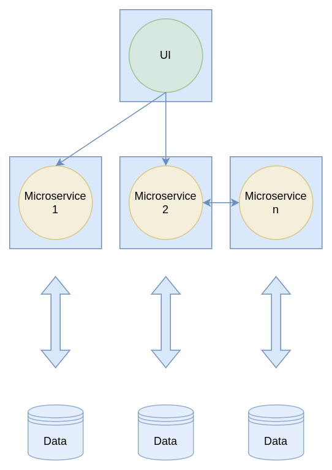
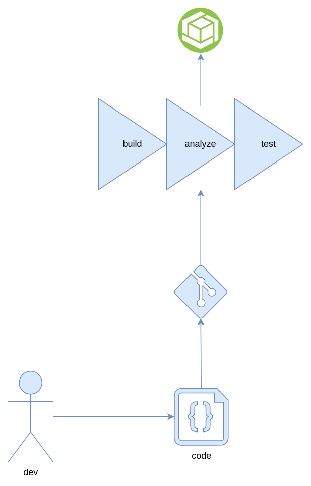
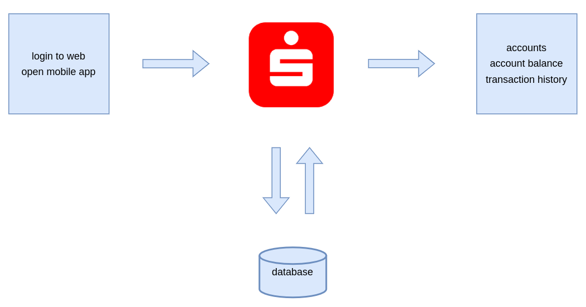

<!--
_paginate: false
_footer: ""
-->

# Cloud Native?
### Michael Kreipl
### 08.07.2022

---

*Insert pictures of kubecon of cloudnativeblablabla here*

---
<!--
_paginate: false
_footer: ""
-->

# whoami

* Michael Kreipl
* DevOps Consultant

Fields of Interest:
- Infrastructure Automation
- Selfhosting
- Sporty things


<!--
Angefangen als linux admin
dann public cloud engineer
und allgemein automation
-->
---

# Motivation

- What are Cloud Native Applications?

---

# Agenda

1. Naive Approach
2. Organizational Approach
3. Science
4. Towards a Definition
5. What now? 

---

# Naive Approach

---

Google -> Wikipedia -> CNCF

---

> Cloud native technologies empower organizations to build and run scalable applications in modern, dynamic environments such as public, private, and hybrid clouds. Containers, service meshes, microservices, immutable infrastructure, and declarative APIs exemplify this approach.
> 
>  These techniques enable loosely coupled systems that are resilient, manageable, and observable. Combined with robust automation, they allow engineers to make high-impact changes frequently and predictably with minimal toil.
> 
>  The Cloud Native Computing Foundation seeks to drive adoption of this paradigm by fostering and sustaining an ecosystem of open source, vendor-neutral projects. We democratize state-of-the-art patterns to make these innovations accessible for everyone.

— *CNCF Cloud Native Definition v1.0*

---

> Cloud native technologies empower organizations to build and run **scalable applications** in modern, **dynamic environments** such as public, private, and hybrid clouds. **Containers, service meshes, microservices, immutable infrastructure, and declarative APIs** exemplify this approach.
> 
>  These techniques enable **loosely coupled systems** that are **resilient, manageable, and observable**. Combined with **robust automation,** they allow engineers to make high-impact changes frequently and predictably with minimal toil.

— *CNCF Cloud Native Definition v1.0*

---

 

---

# Organizational Approach

---


<!--
_footer: ""
-->

---

# x-cellent internal view

* People
* Culture
* Tech
* Engineering

---

# People
- Well Being
- Self Development
- Diversity
- Education

---

# Culture
- Communication
- Feedback
- Interaction
- Efficiency in teams
- Setting Goals
- Achieving Goals
- Celebrating Goals

---

# Tech
- Open Source
- Kubernetes
- Go
- git
- CI/CD

---

# Engineering
- API only
- 12 Factor
- Security
- Container

---

# Science

---


---

## Kratzke, Quint (2017)
1. Standardized Deployment Units
1. Microservices
1. DevOps
2. Softwarization
3. Loose coupling
4. Elastic Platforms
5. State Isolation
6. Versioned REST APIs

---


# Standardized Deployment Units

---

# Standardized Deployment Units

Deployment units wrap a piece of software *in a complete filesystem* that contains everything needed to run: code, *runtime, system tools, system libraries*

<!--
Stellt sicher das es überall gleich läuft 
Muss kein Container sein Virtual Applicances
-->

---

# Standardized Deployment Units

<!--
warum container und nicht VM?
TODO: Serverless adden
-->

---


<!--

-->

---

## Notable early mentions

* Gaurav Banga, Peter Druschel, and Jeffrey C. Mogul. (1999) Resource containers: A new facility for resource management in server systems.
* R. Lottiaux and C. Morin. (2001) Containers: A sound basis for a true single system image.

---


# Microservices


---


<!--
_footer: https://www.flickr.com/photos/psd/13109673843 - no changes
-->
---


<!--
Der Blaue rand ist eine deployment unit
-->

---



---


# The Eternal Enemy: Complexity

> apex predator of grug is complexity
  complexity bad
  say again:
  complexity very bad
  you say now:
  complexity very, very bad
  [...]
  
— https://grugbrain.dev

<!--
Abgekapselte einheuten die eine Sache ziemlich gut machen?
Das kommt uns doch bekannt vor
-->

---

# The Unix philosophy

> (i) Make each program do one thing well. To do a new job, build afresh rather than complicate old programs by adding new features. 

— Eric Steven Raymond in Bell System Technical Journal (1978)

<!--
z.b. ls, mv, tree, touch
abgesehen von systemd
-->

---


# DevOps

---

# DevOps
- Accelerates build test and deployment of Applications
- Focus on Automation

---

## The *classic* Dev role

1. Planning
2. Design
3. Development
4. Testing
5. Delivery



---

## The *classic* Ops role

1. Deploy
2. Monitor
3. Get blamed for outages
   1. [DevOps and the blame problem: an outsider's view (2011)](https://utcc.utoronto.ca/~cks/space/blog/sysadmin/DevopsBlameProblem)
   2. [DevOps: The consequences of blame (2018)](https://opensource.com/article/18/9/consequences-blame-your-devops-team)
   3. [Culture of blaming Ops (/r/kubernetes)](https://www.reddit.com/r/devops/comments/v9wafq/culture_of_blaming_ops/) 


---


<!--
Der DEVELOPER, ganz wichtiger Punkt
wo ist denn dann der OPS hin? Spare ich mir da Personal? -> Platform team
-->

---

# The DevOps platform team

---

# The DevOps platform team
## The basics
- Provide the platform in a **centralized, consistent** manner
  - Container Platform
  - Public Cloud Account
- Coordinate with the Infrastructure team
  - Firewalls
  - Storage
  - Reverse Proxy

<!--
Mindestens macht das Infra team die firewalls in die public cloud

Im falle von OnPrem K8s müssen die nodes ja auch iwo laufen
-->

---

# The DevOps platform team
## Security
- Implement alerting to enforce good security practices
  - Allow only signed images from internal registry
  - Alert when deploying an container image with known CVEs
  - Only allow deployment when a Healthcheck is defined

<!--
Erlaube nicht ohne Healthchecks zu deployen
erlaube keine Container Images zu deployen die bekannte CVEs enthalten
-->

---

# The DevOps platform team
## CI/CD
- Setting up and maintaining a **central** CI/CD Platform
- Setup and maintain test, deploy and verification pipelines for software products

<!--
Mit den DEVs zusammen pipelines entwickeln!
-->

---

# The DevOps platform team
## Observability
  - Provide and maintain a **central** Observability Stack
    - Logging
    - Monitoring
    - Alerting
    - Tracing

---

# The DevOps platform team
## Best Practices
- Provide manageable solutions that are proven to work
  - terraform modules
  - preconfigured helm charts
  - docker-compose templates
  - ansible roles
- Write ~~**good**~~ documentation

<!--

-->

---
# The DevOps platform team
## Simplification
- The developers are the customer, make their work as frictionless as possible
  - Train - present the features of the technology stack
  - Educate - give recommendations on application patterns
  - Encourage - provide a playground for experiments

---

# The DevOps platform team
## Looking Ahead
- provide the necessary platform and capabilities *now*
- steer into the right direction for *the future*

<!--
Da stellt sich die frage, so ein DevOpsler muss ja ne Menge können/wissen?
-->

---

# The DevOps platform team
## Nice to haves
- Provide/utilize a extensible real-time chat solution
- Provide a secret management solution
- Provide a SSO Mechanism for internal/external authentication

<!--
MS teams nicht von Devops managen lassen
aber dann bitte die webhook API freischalten dasman über deployments informieren kann
-->

---

# Softwareization

- Everything as Code

---

# Infrastructure
```json
module "ec2_instance" {
  source  = "terraform-aws-modules/ec2-instance/aws"
  version = "~> 3.0"

  name = "not-a-fruit-😡"

  ami                    = "ami-ebd02392"
  instance_type          = "t3a.large"
  key_name               = "mykey"
  monitoring             = true
  vpc_security_group_ids = ["sg-12345678"]
  subnet_id              = "subnet-eddcdzz4"

  tags = {
    Terraform   = "true"
    Environment = "dev"
  }
}
```

---

# Infrastructure
```json
{
  "type": "Microsoft.Compute/virtualMachines",
  "apiVersion": "2021-11-01",
  "name": "i-run-on-azure-😅",
  "location": "string",
  "tags": {
    "tagName1": "tagValue1",
    "tagName2": "tagValue2"
  },

[...]

  "zones": [ "string" ]
}
```
---

## Kubernetes Cluster
```yaml
kind: Cluster
apiVersion: kind.x-k8s.io/v1alpha4
name: 🍌-prod
nodes:
- role: control-plane
- role: worker
- role: worker
- role: worker
networking:
  disableDefaultCNI: true
```

---

## Kubernetes Cluster
```yaml
apiVersion: k0sctl.k0sproject.io/v1beta1
kind: Cluster
metadata:
  name: 🍎-prod
spec:
  hosts:
  - role: controller
    ssh:
      address: 10.0.0.255
[...]
  k0s:
    version: 1.23.6+k0s.0
    config:
      apiVersion: k0s.k0sproject.io/v1beta1
      kind: Cluster
      metadata:
        name: 🍎-prod
      spec:
        api:
          extraArgs:
            service-node-port-range: 80-32767
        network:
          podCIDR: 10.0.10.0/24
          serviceCIDR: 10.0.11.0/24
```
---

# Kubernetes Cluster
```json
module "eks" {
  source  = "terraform-aws-modules/eks/aws"
  version = "~> 18.0"

  cluster_name    = "🍑-prod"
  cluster_version = "1.21"
  vpc_id     = "vpc-1234556abcdef"
  subnet_ids = ["subnet-abcde012", "subnet-bcde012a", "subnet-fghi345a"]
  cluster_endpoint_private_access = true
  cluster_endpoint_public_access  = true

  cluster_addons = {
    coredns = {
      resolve_conflicts = "OVERWRITE"
    }
    kube-proxy = {}
    vpc-cni = {
      resolve_conflicts = "OVERWRITE"
    }
  }

  eks_managed_node_groups = {
    blue = {}
    green = {
      min_size     = 1
      max_size     = 10
      desired_size = 5

      instance_types = ["t3.large"]
      capacity_type  = "SPOT"
    }
  }
}
```

---

# Applications
ansible:
```yaml
- hosts: all

  vars:
    pip_install_packages:
      - name: docker

  roles:
    - geerlingguy.pip
    - geerlingguy.docker
```
helm:
```sh
helm install argocd -n managed-services -f argo-values.yaml argocd/argocd
```

---
# Certificates

```yaml
apiVersion: cert-manager.io/v1
kind: Certificate
metadata:
  name: noemoji-api
  namespace: prod
spec:
  secretName: frontent-ext-tls
  duration: 2160h # 90d
  renewBefore: 360h # 15d
  subject:
    organizations:
      - ACME
  isCA: false
  privateKey:
    algorithm: RSA
    encoding: PKCS1
    size: 4096
  usages:
    - server auth
  dnsNames:
    - api.noemoji.io
  issuerRef:
    name: ca-issuer
    kind: Issuer
    group: cert-manager.io
```

---

# Softwareization

1. Make an entry in the CMDB
1. Order a new network from the network team
1. Order some VMs from the virtualization team
1. Setup the VMs
1. Install a database
1. Install the application
1. Configure the application
1. Notify the Monitoring team
1. Setup DNS
1. Setup the Reverse Proxy
1. Order TLS Certificates
1. Setup TLS Termination

<!--
_footer: ""

Entweder ich muss mich mit einem haufen systeme befassen.

oder ich muss mit einem haufen Leuten Sprechen
-->

---

| Task                     | K8s                                                             | AWS               |
| ------------------------ | --------------------------------------------------------------- | ----------------- |
| CMDB 📖                  | webhook                                                         | webhook           |
| Configure Network 🕸      | Network Policies                                                | VPC               |
| Provision VM 🖥           | Pod                                                             | EC2               |
| Install DB 🖥             | StatefulSet                                                     | RDS               |
| Install Application 🔧   | Container Image                                                 | SSM ConfigManager |
| Monitoring 🔔            | [prometheus](https://prometheus-operator.dev)                   | CloudWatch        |
| DNS 🔭                   | [external-dns](https://github.com/kubernetes-sigs/external-dns) | Route53           |
| ReverseProxy 📡          | Ingress                                                         | AWS ELB           |
| TLS 🔐              | [cert-manager](https://cert-manager.io)                         | AWS ELB, AWS Certificate Manager            |

---

# 🗣 + 👐 ⟶ 🖹

- Source Control
- Code Reviews
- Reproducability
- Standardization

---

# Elastic Platforms

---

# Elastic Platforms

> Middleware for the execution of custom applications, their communication, and data storage is offered via a self-service interface over a network.

— Fehling et al. (2014) Cloud Computing Patterns

---

# Elastic Platforms

* Docker Swarm
* Apache Mesos
* HashiCorp Nomad
* AWS Elastic Container Service (ECS)
* Azure Container Apps

<!-- Da fehlt doch was? -->

---

# Elastic Platforms

* Docker Swarm
* Apache Mesos
* Hashicorp Nomad
* AWS Elastic Container Service (ECS)
* Azure Container Apps
* **Kubernetes**

---

# Elastic Platforms

* Deployed across different Cloud Service Platforms -> reducing Vendor Lock In
* Encapsulate Deployment Unit heterogeneity
* Limited interoperability between different platforms

---

# State Isolation

---

# Whats state in an application context?

* context is interaction with a remote service
* data from a previous requests which can be utilized in further requests

---

# Examples for Stateless Applications

---


<!--
-->

---

# Examples for Stateless Applications
---


<!--
-->

---

# Examples for Stateless Applications

---


<!--
-->

---
# Examples for Stateful Applications

---



---

# Versioned REST APIs

<!--  -->

---


<!--
Desktop app in go
cli in python (eingekauft)
mobile App in kotlin
-->

---

# Versioned REST APIs


* scalable
* utilizes existing infrastructure
* widespread and well defined standards

But:
* gRPC on the horizon

<!-- Studie worauf alles basiert schon älter, daher REST als alternativlos gesehen -->

---


# Loose coupling

---

# Loose coupling
* Data/Event driven
* eventually consistent

<!-- vorgänge werden asynchron abgehandelt -->

---

- Application
- Database
- Webserver 

---

# What now!?

---


<!--
_footer: |
    From Cloud Naive to Cloud Native - Avoiding mistakes everyone does
    Max Körbächer, Liquid Reply
-->

---


<!--
_footer: |
    From Cloud Naive to Cloud Native - Avoiding mistakes everyone does
    Max Körbächer, Liquid Reply
-->
---


<!--
_footer: |
    From Cloud Naive to Cloud Native - Avoiding mistakes everyone does
    Max Körbächer, Liquid Reply
-->
---


# Limitations

* scale
<!--
Wir brauchen teams für das alles
macht keinen sinn wenn wir für 5 MA selbstgebaute app 
-->
