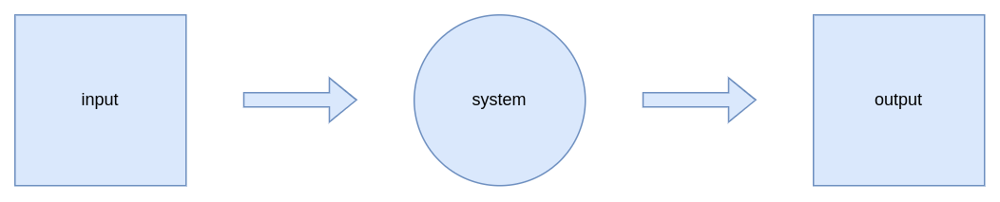

<!--
_paginate: false
_footer: ""
-->

# Cloud Native?

## Michael Kreipl

### 08.07.2022

---

*Insert pictures of kubecon of cloudnativeblablabla here*

---

# Agenda

1. Naive Approach
2. Community Approach
3. Science
4. Towards a Definition
5. What now? 

---

# Naive Approach

---

Google -> Wikipedia -> CNCF

---

> Cloud native technologies empower organizations to build and run scalable applications in modern, dynamic environments such as public, private, and hybrid clouds. Containers, service meshes, microservices, immutable infrastructure, and declarative APIs exemplify this approach.
> 
>  These techniques enable loosely coupled systems that are resilient, manageable, and observable. Combined with robust automation, they allow engineers to make high-impact changes frequently and predictably with minimal toil.
> 
>  The Cloud Native Computing Foundation seeks to drive adoption of this paradigm by fostering and sustaining an ecosystem of open source, vendor-neutral projects. We democratize state-of-the-art patterns to make these innovations accessible for everyone.

— *CNCF Cloud Native Definition v1.0*

---

> Cloud native technologies empower organizations to build and run **scalable applications** in modern, dynamic environments such as public, private, and hybrid clouds. **Containers, service meshes, microservices, immutable infrastructure, and declarative APIs** exemplify this approach.
> 
>  These techniques enable **loosely coupled systems** that are **resilient, manageable, and observable**. Combined with **robust automation,** they allow engineers to make high-impact changes frequently and predictably with minimal toil.
> 
>  The Cloud Native Computing Foundation seeks to drive adoption of this paradigm by fostering and sustaining an ecosystem of open source, vendor-neutral projects. We democratize state-of-the-art patterns to make these innovations accessible for everyone.

— *CNCF Cloud Native Definition v1.0*

---

 

---

# Communicative Approach

---

# x-cellent internal view

* People
* Culture
* Tech
* Engineering

---

# People
- Well Beeing
- Self Development
- Diversity
- Education

---

# Culture
- Communication
- Feedback
- Interaction
- Efficiency in teams
- Setting Goals
- Achieving Goals
- Celebrating Goals

---

# Tech
- Open Source
- Kubernetes
- Go
- git
- CI/CD

---

# Engineering
- API only
- 12 Factor
- Security
- Container

---

# Science

* Microservices
* DevOps
* Softwarization
* Standardized Deployment Units
* Elastic Platforms
* State Isolation
* Versioned REST APIs
* Loose coupling

---

# Microservices

<!--
_footer: https://www.flickr.com/photos/psd/13109673843 - no changes
-->
---

> (i) Make each program do one thing well. To do a new job, build afresh rather than complicate old programs by adding new features. 

— Eric Steven Raymond in Bell System Technical Journal (1978)

---

# DevOps

---
<!--
_footer: 
-->

---

- Shift Left

---

<!--
_footer: |
    From Cloud Naive to Cloud Native - Avoiding mistakes everyone does
    Max Körbächer, Liquid Reply
-->

---

<!--
_footer: |
    From Cloud Naive to Cloud Native - Avoiding mistakes everyone does
    Max Körbächer, Liquid Reply
-->
---

<!--
_footer: |
    From Cloud Naive to Cloud Native - Avoiding mistakes everyone does
    Max Körbächer, Liquid Reply
-->
---

# Softwarization

---

# Standardized Deployment Units

---

# Standardized Deployment Units

Deployment units wrap a piece of software in a complete filesystem that contains everything needed to run: code, runtime, system tools, system libraries

<!--
Stellt sicher das es überall gleich läuft 
Muss kein Container sein Virtual Applicances
-->

---

# What is a Container?

---

# Standardized Deployment Units

<!--
warum container und nicht VM?
-->

---

## Notable early mentions

* Gaurav Banga, Peter Druschel, and Jeffrey C. Mogul. (1999) Resource containers: A new facility for resource management in server systems.
* R. Lottiaux and C. Morin. (2001) Containers: A sound basis for a true single system image.

---

# Elastic Platforms

---

# Elastic Platforms

> Middleware for the execution of custom applications, their communication, and data storage is offered via a self-service interface over a network.

— Fehling et al. (2014) Cloud Computing Patterns

---

# Elastic Platforms

* Docker Swarm
* Apache Mesos
* Hashicorp Nomad
* AWS Elastic Container Service (ECS)
* Azure Container Apps

<!-- Da fehlt doch was? -->

---

# Elastic Platforms

* Docker Swarm
* Apache Mesos
* Hashicorp Nomad
* AWS Elastic Container Service (ECS)
* Azure Container Apps
* **Kubernetes**

---

# Elastic Platforms

* Deployed across different Cloud Service Platforms -> reducing Vendor Lock In
* Encapsulate Deployment Unit heterogeneity
* Limited interoperability between different platforms

---

# State Isolation

---

# Whats state in an application context?

* context is interaction with a remote service
* data from a previous requests which can be utilized in further requests

---

# Examples for Stateless Applications

<!--
-->

---

# Examples for Stateless Applications

<!--
-->

---

# Examples for Stateless Applications

<!--
-->

---
# Examples for Stateful Applications

---

# Versioned REST APIs

---

# Versioned REST APIs

* scalable
* utilizes existing infrastructure
* widespread and well defined standards

But:
* gRPC on the horizon

<!-- Studie worauf alles basiert schon älter, daher REST als alternativlos gesehen -->

---

# Loose coupling

---

# Loose coupling
* Data/Event driven
* eventually consistent

<!-- vorgänge werden asynchron abgehandelt -->

---

# What now!?

---

# Limitations

* serverless

